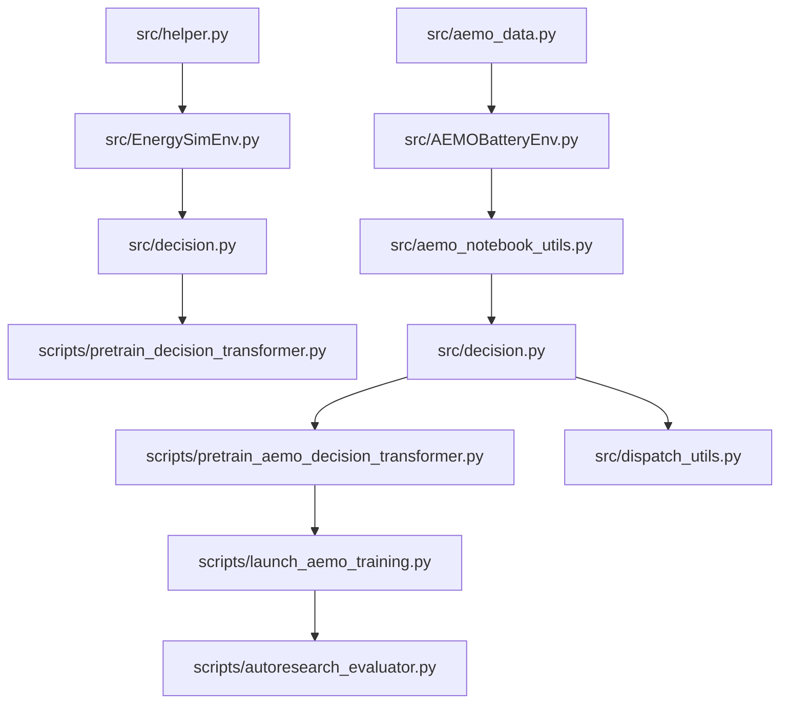

# Code Reference

This document is a compact code-oriented reference for the main implementation surfaces in `src/` and the canonical runnable entrypoints in `scripts/`.

It is not the primary onboarding document. Start with [README.md](README.md), [docs/README.md](docs/README.md), [docs/architecture.md](docs/architecture.md), and [docs/development.md](docs/development.md) if you are new to the repository.

## Core Surfaces

### Environments

- `src/EnergySimEnv.py`: household simulation environment
- `src/AEMOBatteryEnv.py`: grid-scale AEMO environment and preprocessing

### Data and preprocessing

- `src/helper.py`: household transformation, evaluation, visualization, log flattening
- `src/aemo_data.py`: AEMO data access, caching, battery registry, static-table handling
- `src/aemo_notebook_utils.py`: bridge layer for notebook and AEMO workflow orchestration

### Agents and baselines

- `src/decision.py`: `Agent`, `AEMOAgent`, rollout helpers, DT inference wiring
- `src/sdp_algorithm.py`: stochastic dynamic programming
- `src/mrdp_algorithm.py`: multi-resolution dynamic programming
- `src/oracle_algorithm.py`: oracle planning baseline
- `src/sb3train.py`: SB3 training helpers

### Decision Transformer stack

- `src/decision_transformer.py`: model architectures and checkpoint compatibility
- `src/transformer_training.py`: datasets, training loop, resource monitoring
- `scripts/pretrain_decision_transformer.py`: canonical shared DT training surface
- `scripts/pretrain_aemo_decision_transformer.py`: AEMO wrapper entrypoint
- `scripts/launch_aemo_training.py`: higher-level AEMO training launcher

### Evaluation and replay

- `scripts/autoresearch_evaluator.py`: held-out AEMO evaluation
- `src/dispatch_utils.py`: dispatch replay utilities

## By Common Task

### Understand environment behavior

- Household: [docs/household/environment.md](docs/household/environment.md)
- AEMO: [docs/aemo/environment.md](docs/aemo/environment.md)

### Understand agent behavior

- [docs/AGENT_README.md](docs/AGENT_README.md)

### Understand helper and evaluation behavior

- [docs/HELPER_README.md](docs/HELPER_README.md)

### Run AEMO training or evaluation

- Training: `scripts/launch_aemo_training.py`
- Lower-level wrapper: `scripts/pretrain_aemo_decision_transformer.py`
- Held-out evaluation: `scripts/autoresearch_evaluator.py`

### Run household DT training

- `scripts/pretrain_decision_transformer.py`

## Architectural Relationships

## Notes For Maintainers

- Treat `scripts/` as the canonical executable layer.
- Treat `src/` as the reusable implementation layer.
- Keep household and AEMO references conceptually separate when documenting behavior and results.
- Prefer updating the focused docs under `docs/` when adding detail, rather than growing this file back into a long-form handbook.