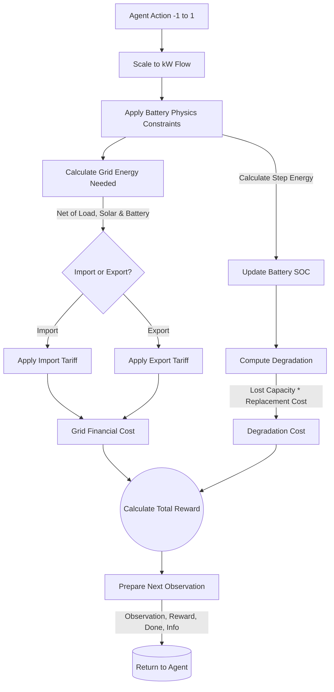

# Household Solar-Battery Environment

The `SolarBatteryEnv` (defined in `src/EnergySimEnv.py`) simulates a single household with:
- **Solar Photovoltaics (PV)**: variable renewable generation.
- **Battery Storage**: allows energy time-shifting.
- **Grid Connection**: import/export of electricity with Time-of-Use (ToU) tariffs.
- **Household Load**: uncontrolled electricity consumption.

This environment is designed to train and benchmark control algorithms (Rule-based, MPC/SDP, RL) on the task of minimizing electricity costs while managing battery degradation.

## Usage

```python
import polars as pl
from src.EnergySimEnv import SolarBatteryEnv
from src.helper import transform_polars_df

# 1. Load data
df = pl.read_csv("data/customer_data.csv")
# 2. Transform to required format (adds future columns, prices, etc.)
dataset = transform_polars_df(
    df,
    import_energy_price=0.30,
    export_energy_price=0.08,
    price_periods="14am-20pm" # Example peak period
)

# 3. Create Environment
env = SolarBatteryEnv(
    dataset,
    battery_capacity=10.0, # kWh
    max_battery_flow=5.0,  # kW
    battery_life_cost=5000.0, # Replacement cost $
    max_step=24*48 # Episode length
)

# 4. Standard Gym Loop
obs, info = env.reset()
done = False
while not done:
    action = env.action_space.sample()
    obs, reward, terminated, truncated, info = env.step(action)
```

## System Model

### Simulation Workflow

The flowchart below illustrates how `SolarBatteryEnv` processes actions and updates household energy states during a step operation:



### Dynamics
The system evolves in discrete time steps (default $\Delta t = 0.5$ hours).

**Battery State of Charge (SoC):**
$$E_{t+1} = E_t + \eta_{chg} P^{chg}_t \Delta t - \frac{1}{\eta_{dis}} P^{dis}_t \Delta t$$
Where $P^{chg}_t, P^{dis}_t$ are controlled by the agent action, constrained by max power and capacity.

**Grid Interaction:**
$$P^{grid}_t = P^{load}_t - P^{solar}_t + P^{chg}_t - P^{dis}_t$$
- $P^{grid}_t > 0$: Import (buy from grid)
- $P^{grid}_t < 0$: Export (sell to grid)

### Observation Space

The observation vectors are normalized to $[0, 1]$ (or $[-1, 1]$ for time features) to facilitate RL training.

| Index | Feature | Description | Range |
|-------|---------|-------------|-------|
| 0-1 | `hour_sin`, `hour_cos` | Cyclical encoding of hour | $[-1, 1]$ |
| 2-3 | `day_sin`, `day_cos` | Cyclical encoding of day-of-year | $[-1, 1]$ |
| 4 | `SolarGen` | Normalized solar generation | $[0, 1]$ |
| 5 | `HouseLoad` | Normalized load consumption | $[0, 1]$ |
| 6 | `FutureSolar` | 1-step forecast of solar | $[0, 1]$ |
| 7 | `FutureLoad` | 1-step forecast of load | $[0, 1]$ |
| 8 | `ImportPrice` | Normalized usage tariff | $[0, 1]$ |
| 9 | `ExportPrice` | Normalized feed-in tariff | $[0, 1]$ |
| 10 | `BatteryLevel` | Current energy stored | $[0, 1]$ |
| 11 | `DegradationCost` | Est. degradation cost (last step) | $[0, 1]$ |

*Note: The exact number of features depends on the input DataFrame columns.*

### Action Space
**Continuous 1D Box:** $[-1, 1]$
- $-1$: Maximum Discharge
- $1$: Maximum Charge
- $0$: Idle

Mapped to physical units (kW) using `max_battery_flow`.

### Reward Function
The goal is to maximize the negative cost (minimize cost).

$$R_t = - (C^{grid}_t + C^{deg}_t + P^{violation}_t)$$

1.  **Grid Cost ($C^{grid}_t$):**
    - Import: $P^{grid}_t \times \text{ImportPrice}_t$
    - Export: $P^{grid}_t \times \text{ExportPrice}_t$ (Revenue is negative cost)
2.  **Degradation Cost ($C^{deg}_t$):**
    - Calculated using a specialized semi-empirical degradation model (`src/batterydeg.py`).
    - Considers: Throughput (Amps), Cycle Depth (DoD), and C-rate.
    - Cost is proportional to the lost fraction of battery life $\times$ replacement cost.
3.  **Penalties ($P^{violation}_t$):**
    - Large penalty if physics constraints are violated (e.g., resulting SoC < 0).

## Degradation Model
The environment uses a rainflow-counting based degradation model or a linear approximation depending on configuration.
See [src/batterydeg.py](../src/batterydeg.py) for the implementation of the "Weighted Ah-Throughput" model which accounts for:
- **Cycle Depth**: Deeper cycles cause super-linear wear.
- **C-rate**: Higher currents increase degradation.
- **Temperature**: Arrhenius dependence (if enabled).

The agent receives the calculated degradation cost in the `info` dictionary and as a normalized component of the observation.
