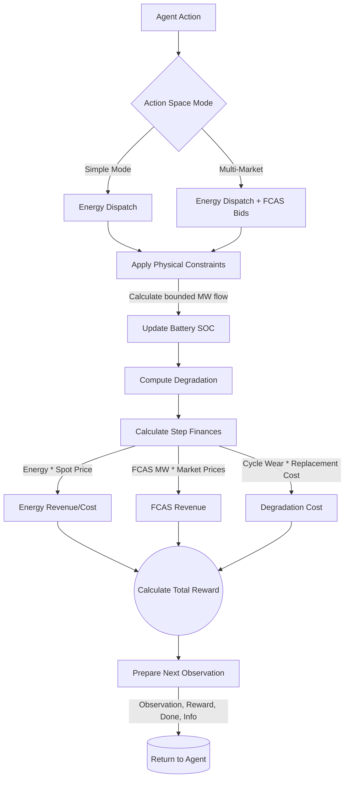

# AEMO Battery Trading Environment

This is the **environment reference** for the AEMO grid-scale battery simulator.

Use this document when you need:

- the environment overview
- observation and action space details
- reward mechanics
- market-data and battery-model behavior

If you want a map of all AEMO docs first, start with [README.md](README.md). For deeper degradation modeling detail, see [degradation.md](degradation.md).

A Gymnasium environment for simulating battery energy storage systems (BESS) participating in the Australian National Electricity Market (NEM), including both energy spot market and Frequency Control Ancillary Services (FCAS) markets.

## Overview

This environment enables reinforcement learning agents to learn optimal battery trading strategies using real AEMO market data. It supports:

- **Energy market arbitrage**: Buy low, sell high strategies
- **FCAS market participation**: Provide frequency regulation services
- **Multi-market optimization**: Simultaneous energy and FCAS trading
- **Real market data**: Integration with AEMO via NEMOSIS
- **Battery degradation**: Realistic cost modeling with three modes: Muenzel et al. (2015) rainflow cycle counting, real-world BESS calendar + cycle aging (Kampker et al. 2025), or simplified linear

## Simulation Workflow

The flowchart below illustrates how the `AEMOBatteryTradingEnv` processes actions and updates the market state during a step operation:



## Quick Start

### Installation

```bash
pip install gymnasium numpy pandas polars
pip install nemosis  # For real AEMO data
```

### Basic Usage

```python
from src.AEMOBatteryEnv import create_aemo_env_from_data
from datetime import datetime

# Create environment with real AEMO data
env = create_aemo_env_from_data(
    start_date=datetime(2024, 6, 1),
    end_date=datetime(2024, 6, 7),
    region="NSW1",
    battery_capacity=10.0,   # MWh
    max_battery_flow=5.0,    # MW
    action_mode='simple',    # 'simple' or 'multi_market'
    degradation_mode='real_world',    # 'real_world', 'rainflow', or 'simple'
    degradation_chemistry='LFP',      # 'NMC' or 'LFP' (for real_world mode)
    degradation_temperature=25.0,     # °C for the degradation model
)

# Standard Gym interface
obs, info = env.reset()
done = False
total_reward = 0

while not done:
    action = env.action_space.sample()  # Replace with your policy
    obs, reward, terminated, truncated, info = env.step(action)
    done = terminated or truncated
    total_reward += reward

print(f"Episode reward: {total_reward:.2f}")
```

## Environment Specifications

### Observation Space

18-dimensional continuous observation space:

1. **Time features (5)**: hour_sin, hour_cos, day_sin, day_cos, is_peak
2. **Energy market (2)**: RRP_normalized, DEMAND_normalized  
3. **FCAS prices (8)**: Normalized prices for 8 FCAS services
   - RAISEREG, LOWERREG
   - RAISE6SEC, LOWER6SEC
   - RAISE60SEC, LOWER60SEC
   - RAISE5MIN, LOWER5MIN
4. **Generation mix (2)**: solar_pct, wind_pct
5. **Battery state (1)**: SOC normalized [0, 1]

All features normalized to [0, 1] range for stable learning.

### Action Space

The action represents the **normalized requested capability allocation**. It is scaled to actual physical limits (MW) by multiplying the action by the grid-scale `max_battery_flow`.

**Simple Mode** (energy arbitrage only):
- Single continuous action in `[-1, 1]` indicating Active Power flow.
- `-1` = maximum discharge (sell to grid)
- `0` = idle
- `+1` = maximum charge (buy from grid)

**Multi-Market Mode** (energy + FCAS):
- 3D continuous action space:
  - `action[0]`: Battery energy dispatch in `[-1, 1]`
    - `action[1]`: FCAS raise bid capability in `[0, 1]` (fraction of `max_battery_flow` in MW dedicated to raise support)
    - `action[2]`: FCAS lower bid capability in `[0, 1]` (fraction of `max_battery_flow` in MW dedicated to lower support)

### Reward Function

```python
reward = energy_revenue - energy_cost + fcas_revenue - degradation_cost - penalties
```

Components:
- **Energy revenue**: Discharge power × RRP × time (when discharging)
- **Energy cost**: Charge power × RRP × time (when charging)
- **FCAS revenue**: Simplified FCAS enablement in MW × FCAS price ($/MW/h) × time (multi-market mode)
- **Degradation cost**: Based on depth of discharge and cycle count
- **Penalties**: SOC constraint violations

In the simplified FCAS model, bid fractions are converted to MW using
`max_battery_flow`, then capped by one-step SOC headroom before settlement.
This keeps FCAS revenue dimensionally consistent with AEMO FCAS prices and
avoids inflating revenue by treating battery energy capacity (MWh) as power
capability (MW).

Reward is normalized to approximately [-1, 1] range for training stability.

## Features

### Real AEMO Market Data

The environment integrates with NEMOSIS to fetch actual AEMO market data:

- **5-minute dispatch prices**: Regional reference prices (RRP)
- **FCAS prices**: All 8 ancillary service markets
- **Generation mix**: Solar, wind, and other fuel types
- **Regional demand**: Total electricity demand

Data is automatically resampled to match environment step duration (default 30 minutes).

### Battery Constraints

- **Capacity limits**: SOC ∈ [0, battery_capacity]
- **Power limits**: |P| ≤ max_battery_flow
- **Energy conservation**: SOC(t+1) = SOC(t) + P·Δt
- **Degradation tracking**: Three modes available:
  - `'real_world'` — Combined calendar + cycle aging adapted from Kampker et al. (2025), with Arrhenius temperature dependency and NMC/LFP chemistry presets. Recommended for grid-scale simulations. Tracks `calendar_degradation` and `cycle_degradation` separately.
  - `'rainflow'` — Muenzel et al. (2015) rainflow counting with capacity fade (cycle aging only, no calendar aging)
  - `'simple'` — Linear DoD-based approximation (backward compatible)

### Data Preprocessing

The `AEMODataPreprocessor` class handles:
- Time alignment (5-min to 30-min)
- Missing data interpolation
- Feature normalization
- Cyclical time encoding
- FCAS and generation data pivoting

## Example Applications

### 1. Train PPO Agent

```python
from stable_baselines3 import PPO

env = create_aemo_env_from_data(...)
model = PPO("MlpPolicy", env, verbose=1)
model.learn(total_timesteps=100_000)
model.save("aemo_battery_ppo")
```

### 2. Rule-Based Baseline

```python
def simple_arbitrage(obs):
    price = obs[5]  # RRP_normalized
    soc = obs[-1]   # Battery SOC
    
    if price < 0.3 and soc < 0.9:
        return np.array([0.8])  # Charge
    elif price > 0.7 and soc > 0.1:
        return np.array([-0.8])  # Discharge
    else:
        return np.array([0.0])  # Idle
```

### 3. Backtest Strategy

```python
env = create_aemo_env_from_data(
    start_date=datetime(2024, 1, 1),
    end_date=datetime(2024, 12, 31),
    region="NSW1"
)

obs, _ = env.reset()
total_revenue = 0

for _ in range(1000):
    action = policy(obs)  # Your trained policy
    obs, reward, done, _, info = env.step(action)
    total_revenue += info['total_revenue']
    if done:
        break

print(f"Annual revenue: ${total_revenue:,.2f}")
```

### 4. Degradation-aware Backtest

```python
env = create_aemo_env_from_data(
    start_date=datetime(2024, 1, 1),
    end_date=datetime(2024, 12, 31),
    region="NSW1",
    degradation_mode='real_world',        # Combined calendar + cycle aging
    degradation_chemistry='LFP',          # LFP chemistry preset
    degradation_temperature=25.0,
)

obs, info = env.reset()
total_revenue = 0

while True:
    action = policy(obs)
    obs, reward, done, _, info = env.step(action)
    total_revenue += info['total_revenue']
    print(f"Step degradation {info['step_degradation']:.6f}, "
          f"calendar={info['calendar_degradation']:.6f}, "
          f"cycle={info['cycle_degradation']:.6f}, "
          f"capacity {info['capacity_mwh']:.2f} MWh")
    if done:
        break

print(f"Total degradation: {info['total_degradation']:.4f}")
print(f"Degradation-aware annual revenue: ${total_revenue:,.2f}")
```

## Configuration Options

### Environment Parameters

```python
AEMOBatteryTradingEnv(
    aemo_data,                      # Preprocessed DataFrame
    battery_capacity=10.0,          # MWh
    max_battery_flow=5.0,           # MW
    init_battery_level=5.0,         # MWh (starting SOC)
    max_step=1000,                  # Steps per episode
    step_duration=0.5,              # Hours (30 min)
    battery_life_cost=1_000_000.0,  # USD
    action_mode='simple',           # or 'multi_market'
    degradation_mode='real_world',  # 'real_world', 'rainflow', or 'simple'
    degradation_chemistry='LFP',    # 'NMC' or 'LFP' (real_world mode only)
    degradation_temperature=25.0,   # °C ambient temperature for degradation
)
```

**Degradation modes:**

| Mode | Model | Calendar aging | Cycle aging | Chemistry presets | Best for |
|------|-------|---------------|-------------|-------------------|----------|
| `'real_world'` | Kampker et al. (2025) | ✅ Arrhenius + SOC stress | ✅ Power-law DoD + Arrhenius + C-rate | NMC / LFP | Grid-scale AEMO simulations |
| `'rainflow'` | Muenzel et al. (2015) | ❌ | ✅ Multi-factor polynomial | — | Cell-level research |
| `'simple'` | Linear approximation | ❌ | ✅ Linear DoD | — | Quick prototyping |

`degradation_temperature` feeds the degradation model and should match the ambient
operating temperature of the grid asset (default 25 °C); higher temperatures accelerate
degradation in both calendar and cycling modes via the Arrhenius relationship.

### Data Fetching Parameters

```python
create_aemo_env_from_data(
    start_date,
    end_date,
    region="NSW1",                  # NSW1, QLD1, SA1, VIC1, TAS1
    cache_dir="data/aemo",
    battery_capacity=10.0,
    max_battery_flow=5.0,
    degradation_mode='real_world',  # recommended for grid-scale
    degradation_chemistry='LFP',    # LFP for modern utility BESS
    degradation_temperature=25.0,
)
```

## API Reference

### `AEMODataPreprocessor`
- `__init__(step_duration_hours=0.5, missing_data_method='interpolate', add_normalized_features=True, update_stats_from_data=True)`
    - **Args**: controls how raw AEMO data is resampled (`step_duration_hours`), how gaps are filled (`missing_data_method`), whether normalized columns are appended (`add_normalized_features`), and whether the stats dictionary is updated from the incoming data (`update_stats_from_data`).
    - **Returns**: preprocessor ready to convert fetched price/fcas/generation tables into environment-ready Polars DataFrames.
- `preprocess_aemo_data(prices, fcas, generation)`
    - **Args**: three Polars DataFrames from `fetch_aemo_dispatch_price`, `fetch_aemo_fcas_price`, and `fetch_aemo_generation_by_fuel`.
    - **Returns**: unified DataFrame containing resampled market features, cyclical time encodings, normalized columns, and generation mix percentages, aligned to the env step scale. Internally uses `_resample_data`, `_resample_fcas`, `_resample_generation`, `_merge_datasets`, `_handle_missing_data`, `_add_time_features`, and `_normalize_features` to produce the final table.

### `AEMOBatteryTradingEnv`
- `__init__(aemo_data, battery_capacity=10.0, max_battery_flow=5.0, init_battery_level=5.0, max_step=1000, step_duration=0.5, battery_life_cost=1_000_000.0, render_mode=None, action_mode='simple', normalize_obs=True, return_raw_obs=False, degradation_mode='rainflow', degradation_temperature=25.0, degradation_chemistry='NMC')`
    - **Args**: `aemo_data` is the processed Polars DataFrame; the others configure capacity/flow, episode length, FCAS action mode, normalization toggles, and whether `get_raw_obs()` results should be returned from `reset()`/`step()`. `degradation_mode` selects the physics model: `'real_world'` for combined calendar + cycle aging (Kampker et al. 2025, recommended for grid-scale), `'rainflow'` for Muenzel et al. (2015) cycle-only aging, or `'simple'` for the legacy linear model. `degradation_temperature` sets the ambient temperature for Arrhenius-based models. `degradation_chemistry` (`'NMC'` or `'LFP'`) selects chemistry presets for the `'real_world'` mode.
    - **Returns**: `AEMOBatteryTradingEnv` instance with observation/action spaces, SOC bookkeeping, revenue tracking, and degradation accounting initialized.
- `reset(seed=None, options=None)`
    - **Args**: optional Gym seed and `options` dict (supports `return_raw_obs` override).
    - **Returns**: `(obs, info)` where `obs` is the normalized observation vector (plus raw if `return_raw_obs`) and `info` is an empty dict (populated later by `step`). Random episode start index is chosen within cached data.
- `step(action)`
    - **Args**: normalized action ([-1,1]) or 3-vector depending on `action_mode`. Converts to MW dispatch/FCAS enablements, updates SOC, computes revenue/degradation, records metrics, and advances `current_step`.
    - **Returns**: tuple `(obs, reward, terminated, truncated, info)`, with `info` containing `energy_revenue`, `fcas_revenue`, `step_degradation`, `total_degradation`, `capacity_mwh`, `rainflow_cumulative_deg`, `rainflow_num_cycles`, `calendar_degradation`, `cycle_degradation`, `total_revenue`, `total_degradation_cost`, and the latest `market_data` row.
- `render()`
    - **Returns**: currently a placeholder (prints human-friendly summary when implemented). Use `render_mode='human'` to enable future output.

### Convenience Functions
- `create_aemo_env_from_data(start_date, end_date, region='NSW1', cache_dir='data/aemo', **env_kwargs)`
    - **Args**: date range, region, cache path, plus any `AEMOBatteryTradingEnv`-compatible overrides.
    - **Returns**: initialized env after fetching via `fetch_aemo_data_bundle` and preprocessing through `AEMODataPreprocessor`.
- `fetch_aemo_data_bundle(start_date, end_date, region='NSW1', fcas_services=None, fuel_types=None, generator_info_path=None, cache_dir='data/aemo', refresh=False)`
    - **Args**: spans energy prices, FCAS services, and fuel types to fetch; optional generator mapping. If AEMO blocks the static table download, pass `generator_info_path` to a manually downloaded **NEM Registration and Exemption List** spreadsheet or set `AEMO_GENERATORS_FILE`.
    - **Returns**: dict with `prices`, `fcas`, and `generation` Polars DataFrames ready for preprocessing.
- `fetch_aemo_unit_dispatch(start_date, end_date, duid=None, region=None, generator_info_path=None, cache_dir='data/aemo', refresh=False)`
    - **Args**: yields unit-level dispatch including `TOTALCLEARED` and FCAS enablement for the specified DUID/region.
    - **Returns**: Polars DataFrame used by `AEMOAgent` for dispatch replay/FCAS revenue accounting.
```

Manual static-table fallback:

- Direct file URL used by NEMOSIS:
  `https://www.aemo.com.au/-/media/Files/Electricity/NEM/Participant_Information/NEM-Registration-and-Exemption-List.xls`
- AEMO page for manual lookup if the direct link changes:
  `https://www.aemo.com.au/energy-systems/electricity/national-electricity-market-nem/participate-in-the-market/registration/registered-participants`
- Recommended repo-local placement:
  `data/aemo/manual/NEM Registration and Exemption List.xls`
- Runtime static cache:
  `data/aemo/_nemosis_static/`

## Testing

Run the test notebook:

```bash
jupyter notebook notebooks/test_aemo_env.ipynb
```

Or use the provided test script:

```python
python3 << 'EOF'
import sys
sys.path.insert(0, 'src')
from AEMOBatteryEnv import AEMOBatteryTradingEnv
import numpy as np
import pandas as pd

# Create synthetic test data
test_data = pd.DataFrame({...})  # See test notebook

env = AEMOBatteryTradingEnv(test_data, ...)
obs, info = env.reset()

for _ in range(100):
    action = env.action_space.sample()
    obs, reward, done, _, info = env.step(action)
    if done:
        break

print("Test passed!")
EOF
```

## Performance Metrics

The environment tracks:

- **Total revenue**: Energy + FCAS earnings
- **Degradation cost**: Battery wear
- **Net profit**: Revenue - costs
- **SOC utilization**: Battery usage patterns
- **Cycle count**: Equivalent full cycles

Access via `info` dict returned by `step()`.

## Roadmap

- [x] Phase 1: Basic environment with energy arbitrage
- [x] Phase 2: FCAS market integration
- [x] Phase 5: Advanced degradation models (real-world BESS calendar + cycle aging)
- [ ] Phase 3: Price forecasting features
- [ ] Phase 4: Multi-region support
- [ ] Phase 6: Benchmark suite with trained agents

## References

- [AEMO Market Data](https://aemo.com.au/energy-systems/electricity/national-electricity-market-nem/data-nem)
- [FCAS Services](https://aemo.com.au/energy-systems/electricity/national-electricity-market-nem/system-operations/ancillary-services)
- [NEMOSIS Library](https://github.com/UNSW-CEEM/NEMOSIS)

## License

Same as parent repository.

## Citation

If you use this environment in research, please cite:

```bibtex
@software{aemo_battery_env_2024,
  title={AEMO Battery Trading Environment},
  author={Energy Decision Project},
  year={2024},
  url={https://github.com/mrvictoru/energydecision}
}
```
