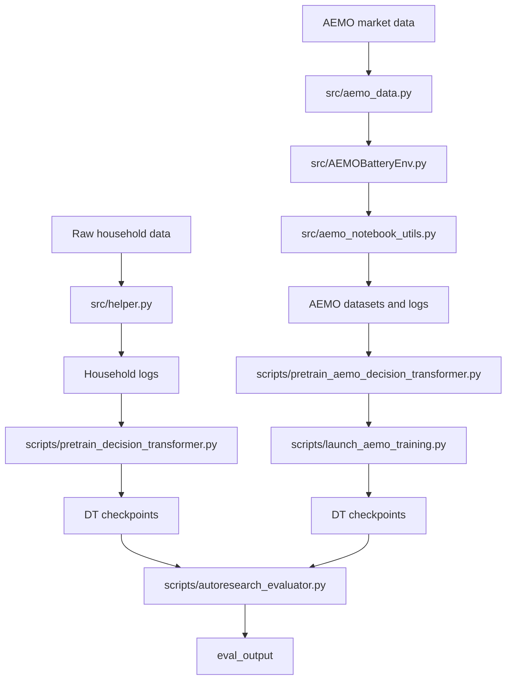

# Architecture Guide

This guide explains how the repository is organized and how the major pieces fit together.

## Two Research Tracks

The repo contains two related but distinct problem settings.

### Household track

- Environment: `src/EnergySimEnv.py`
- Main helper/preprocessing surface: `src/helper.py`
- Agent and baselines: `src/decision.py`
- Focus: residential PV, load, tariffs, battery control

### AEMO track

- Environment: `src/AEMOBatteryEnv.py`
- Market data access: `src/aemo_data.py`
- Notebook and workflow bridge: `src/aemo_notebook_utils.py`
- Agents and dispatch replay: `src/decision.py`, `src/dispatch_utils.py`
- Focus: energy arbitrage plus FCAS bidding in the NEM

Do not compare results across these two tracks unless a document explicitly says that is the purpose.

## Repository Layers

### `scripts/`

Canonical runnable entrypoints. If someone asks, "what command should I run?", the answer should usually come from here.

Examples:

- `scripts/pretrain_decision_transformer.py`
- `scripts/pretrain_aemo_decision_transformer.py`
- `scripts/launch_aemo_training.py`
- `scripts/autoresearch_evaluator.py`

### `src/`

Reusable implementation modules. This is where environments, models, data access, and training primitives live.

### `notebooks/`

Notebook-first exploratory and reproducibility workflows. These are useful for inspection and interactive work, but they should not replace the canonical CLI surfaces in `scripts/`.

### `configs/`

Model configs, evaluator configs, and tier definitions.

### `tests/`

Pytest-based validation for the parts of the repo that are covered.

### `data/`, `models/`, `eval_output/`

Artifact directories for cached data, trained weights, and evaluation outputs.

## Core Module Map

### Environments

- `src/EnergySimEnv.py`: household simulation environment
- `src/AEMOBatteryEnv.py`: AEMO environment and preprocessing

### Data ingestion and preprocessing

- `src/helper.py`: household data transforms, evaluation helpers, visualization support
- `src/aemo_data.py`: AEMO/NEMOSIS access, caching, battery registry logic
- `src/aemo_notebook_utils.py`: higher-level AEMO workflow glue for notebooks and scripts

### Agents and baselines

- `src/decision.py`: rule-based control, DT inference, RL wrappers, AEMOAgent
- `src/sdp_algorithm.py`: stochastic dynamic programming
- `src/mrdp_algorithm.py`: multi-resolution dynamic programming
- `src/oracle_algorithm.py`: oracle planning baseline
- `src/sb3train.py`: SB3 training helpers

### Decision Transformer stack

- `src/decision_transformer.py`: model architectures and checkpoint loading
- `src/transformer_training.py`: dataset windowing, training loop, monitoring
- `scripts/pretrain_decision_transformer.py`: canonical shared training surface
- `scripts/pretrain_aemo_decision_transformer.py`: AEMO wrapper around the shared trainer
- `scripts/launch_aemo_training.py`: higher-level AEMO launcher

### Evaluation and replay

- `scripts/autoresearch_evaluator.py`: held-out AEMO evaluator
- `src/dispatch_utils.py`: dispatch replay helpers
- `docs/evaluation_guide.md`: evaluator usage and interpretation

## System View

## Artifact Conventions

Common artifact locations in the repo:

- `data/household/logs/`
- `data/aemo_dt/`
- `data/aemo_dt_fcas/`
- `models/household/sb3/`
- `models/household/dt/`
- `models/aemo_sb3/`
- `models/aemo/dt/`
- `eval_output/`

## Reading Order

If you are new to the repo:

1. Read [../README.md](../README.md).
2. Read [development.md](development.md).
3. Choose [aemo/README.md](aemo/README.md) or [household/README.md](household/README.md).
4. Use [../COMPONENTS.md](../COMPONENTS.md) only after you want deeper module-level detail.