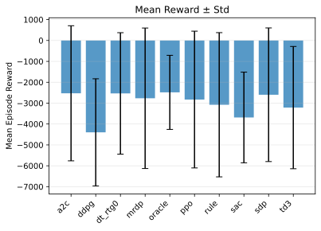
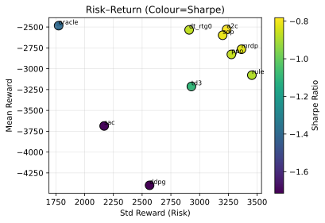
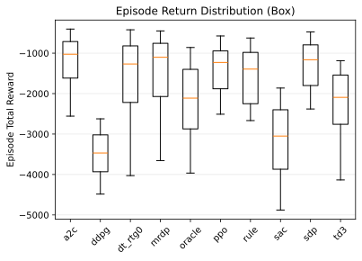
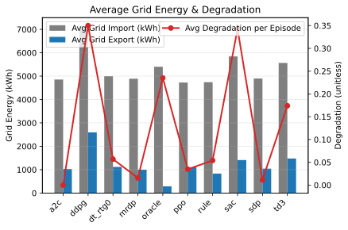
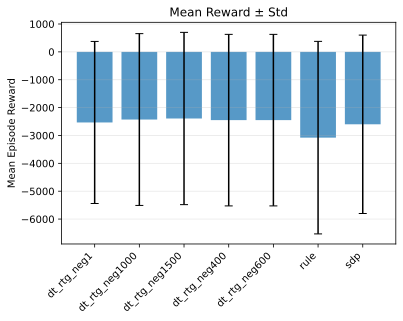
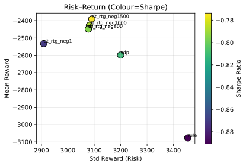
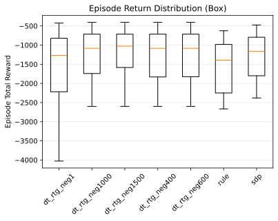
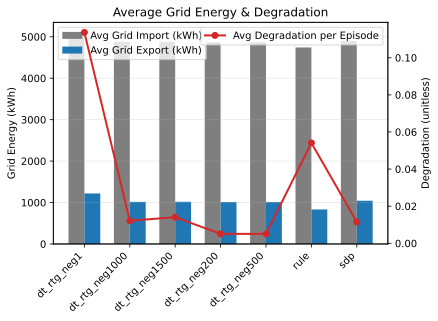
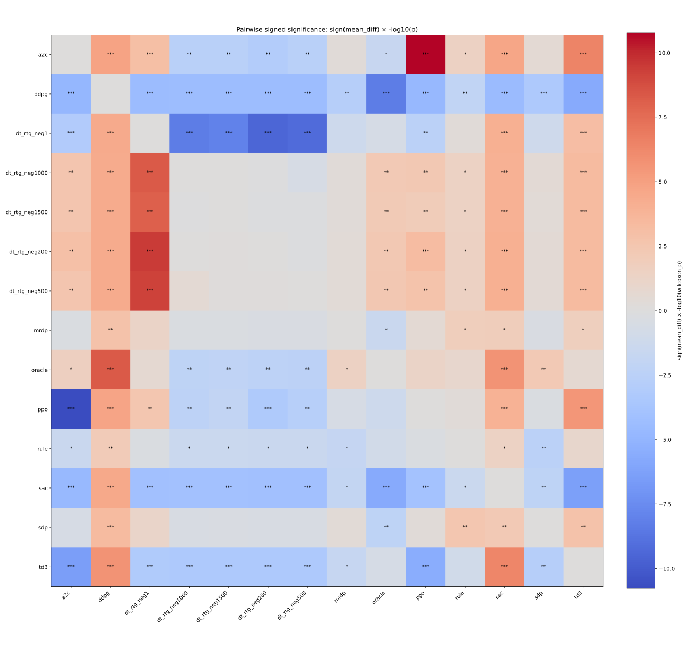
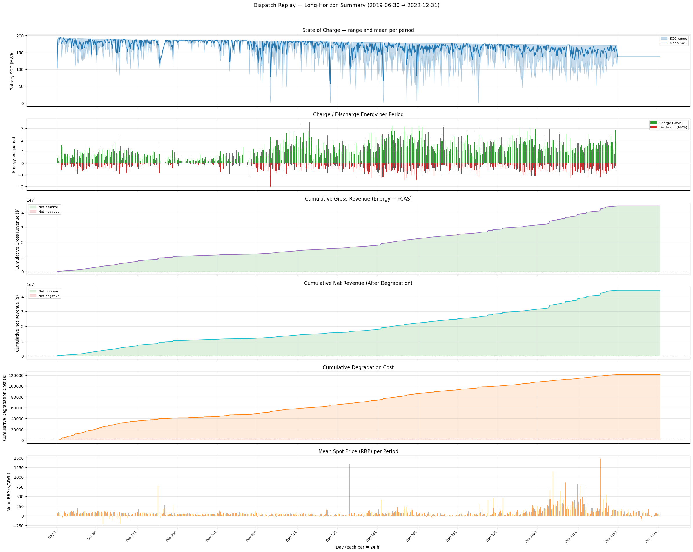

# Benchmarking and Advancing Control Strategies for Energy Storage: A Unified Framework Across Household Solar-Battery Control and Utility-Scale AEMO Battery Operation

## Abstract

The effective integration of battery energy storage is critical for a reliable, renewable-dominant grid, spanning both behind-the-meter residential operation and utility-scale market participation. Developing and comparing control strategies can be challenging when environments omit key factors such as stochastic demand/generation, time-varying tariffs or market prices, and battery degradation. This report documents a research codebase that provides two Gymnasium-compatible environments—(i) a household solar+battery controller and (ii) a utility battery trading environment for AEMO/NEM with an implemented historical dispatch-replay workflow—and a shared evaluation workflow.

The **primary learning model** in this codebase is an **offline Decision Transformer (DT)** trained from logged trajectories to produce continuous battery-charge/discharge actions conditioned on a desired return-to-go (RTG). A core motivation of this repository is to bring **modern transformer-based sequence modeling** to the practical challenge of battery operation, and to evaluate these models against established planning and RL baselines under consistent dynamics and metrics. Rule-based heuristics, dynamic-programming planners (SDP/MRDP), online RL baselines (Stable-Baselines3), and dispatch-replay baselines for the AEMO environment are included primarily as comparators and data-generators for DT training.

## 1. Introduction

The proliferation of energy storage across the grid—from distributed, behind-the-meter household batteries to grid-scale battery energy storage systems (BESS) participating in wholesale markets—presents both a challenge and an opportunity for modern power systems. While these assets can reduce consumer costs and provide grid flexibility, their optimal operation is non-trivial. The control problem is characterized by stochastic demand/generation, time-varying tariffs or market prices, non-linear battery degradation dynamics, and strict physical constraints [6].

Recent literature also helps structure the space of RL-based battery control problems. Subramanya et al. [6] review RL applications for battery storages through multiple lenses (optimization objective, user impact/comfort where applicable, battery losses & degradation, and application context). This benchmark is designed to make these dimensions explicit in a single codebase so that planning and learning approaches can be compared under consistent dynamics and evaluation.

In addition, this work is motivated by the opportunity to apply **modern transformer-based sequence models** (via Decision Transformers) to energy storage control, treating battery dispatch as a sequential decision-making problem that can benefit from transformer representations and return-conditioning.

### 1.1 The Research Gap
Despite substantial literature on energy management systems (EMS), reproducibility and cross-paper comparability can be difficult when studies rely on custom environments, private data, and differing assumptions (e.g., constraint handling, tariff structure, or whether degradation is modeled). There is also a practical gap between model-based planning approaches (e.g., dynamic programming / MPC-style methods) and learning-based approaches (e.g., RL and sequence models), which motivates a unified benchmark.

Recent review work supports this benchmark direction: Subramanya et al. [6] note that comparisons across RL-for-battery studies are hindered by unique formulations (environments, state/action spaces, and rewards), and argue that benchmark environments with a standard interface would improve comparability.

### 1.2 Contributions and Research Goals
This work establishes a consolidated, reproducible benchmark to address these limitations. We provide:
1.  **Two Gymnasium-Compatible Simulation Environments:** Environments for (a) household solar+battery operation under ToU import/export pricing and (b) grid-scale battery trading under AEMO/NEM market signals (energy + optional FCAS), including replay of historical utility-scale station actions.
2.  **Decision Transformer as the Primary Model:** A modernized Decision Transformer implementation plus an offline training pipeline built around trajectory logging, RTG construction, return scaling, and robust checkpoint loading.
3.  **Baselines as Comparators and Data Sources:** A unified interface for comparing rule-based heuristics, SDP/MRDP planners, online RL (PPO, SAC, etc.), and (for AEMO) dispatch replay against DT, and for generating trajectory data for offline learning.
4.  **Standardized Evaluation Workflow:** Metrics for return, grid energy flows, degradation, risk proxies (Sharpe/Sortino ratios), tail-risk analysis (VaR/CVaR at 5%), bootstrap confidence intervals, and paired statistical comparisons (Wilcoxon signed-rank), plus plotting utilities.

The goal of this platform is to provide a reusable baseline for studying generalization and robustness in control policies for decentralized energy systems.

## 2. Related Work

This work is inspired by Abdulla et al. [1], which formulates optimal operation of energy storage using Stochastic Dynamic Programming (SDP) and emphasizes the importance of uncertainty and degradation for realistic assessment.

We adopt an SDP-style planning baseline (implemented in this repository) and a multi-factor degradation model based on Muenzel et al. [2] (implemented in `src/batterydeg.py`).  Alongside these planning components, the Decision Transformer framework [4] motivated our implementation of a transformer‑based sequence model trained with offline RL; this becomes the primary learning baseline in the codebase.  We extend the planning baseline with additional learning‑based baselines and a Gymnasium environment wrapper.

## 3. System Model and Environments

This repository provides two primary environments.

### 3.1 Household Solar-Battery Environment (SolarBatteryEnv)
Environment: `src/EnergySimEnv.py` defines `SolarBatteryEnv` with:
- Action: 1D normalized battery power in [-1, 1]. In `step()`, this is scaled to kW via `max_battery_flow`, converted to step energy (kWh) via `step_duration`, and clipped by SoC and capacity.
- Observation: always normalized in the current implementation (`normalize_obs = True`). It includes cyclical time features (sin/cos of hour/day-of-year), min–max normalized dataframe features, and two extra features: battery level and current-step degradation cost (both normalized).
- Dynamics: `step_duration` is inferred from the dataframe `Time` column (hours between the first two timestamps, with a fallback). The grid energy is clipped to `max_grid_energy = max_grid_flow × step_duration`, and energy-conservation violations yield an early termination with `VIOLATION_PENALTY`.
- Reward/cost: per-step reward is `grid_reward - current_step_deg_cost`, where `grid_reward` is `-(grid_energy × price)` (import vs export prices selected by sign), and degradation cost is derived from per-cycle wear × `battery_life_cost`.
- Degradation: the environment uses rainflow counting over the SoC trajectory to extract cycles, then applies a multi-factor cycle-life model based on Muenzel et al. [2] (temperature, C-rates, SOCav, DoD) to compute per-cycle degradation.

Dataset contract (from `src/helper.py::transform_polars_df`):
`Timestamp, SolarGen, HouseLoad, FutureSolar, FutureLoad, ImportEnergyPrice, ExportEnergyPrice, Time` (sorted by `Time`).

### 3.2 Utility-Scale AEMO Battery Trading Environment (AEMOBatteryTradingEnv)
Environment: `src/AEMOBatteryEnv.py` defines `AEMOBatteryTradingEnv`, a Gymnasium environment for a grid-scale BESS participating in Australia's National Electricity Market (NEM). Key design points implemented in the repository include:
- **Market signals:** the environment consumes preprocessed AEMO data with energy spot price (`RRP`), regional demand (`TOTALDEMAND`), optional FCAS service prices (wide columns prefixed `FCAS_`), and optional generation mix features (wide columns prefixed `GEN_`).
- **Observation space:** a fixed 18-dimensional vector (time features, normalized energy price and demand, normalized FCAS service prices, generation mix, and normalized SOC). `AEMODataPreprocessor` adds normalization columns (e.g., `RRP_normalized`, `DEMAND_normalized`, `FCAS_*_normalized`).
- **Action space:**
	- `action_mode='simple'`: 1D action in [-1, 1] for energy-only charge/discharge.
	- `action_mode='multi_market'`: 3D action `[battery_dispatch, fcas_raise_bid, fcas_lower_bid]` with dispatch in [-1,1] and FCAS bids in [0,1].
- **Units and scale:** default capacity/flow are specified in MWh/MW (grid-scale), distinct from the household environment (kWh/kW).
- **Degradation:** supports `degradation_mode='rainflow'` using the same `DegradationModel` + `RainflowCounter` primitives as the household environment, tracking `step_degradation`, `total_degradation`, and capacity fade.
- **Historical dispatch replay:** utility-scale notebooks and helpers can resolve a station name or DUID to the battery unit(s) active in a selected historical window, load AEMO `DISPATCHLOAD` records, and replay those observed actions inside the environment as a benchmark trajectory.

## 4. Methods

Baselines and planners are implemented in `src/decision.py` (Agent abstraction):
- Rule-based: a heuristic using surplus/deficit logic, optional persistence, and small injected noise (see `Agent.rule_based_action`).
- RL (SB3): PPO/A2C/DDPG/SAC/TD3 via `src/sb3train.py::train_model`; rollouts collected by `run_sb3_model_on_vec_env` and flattened with `flatten_episode_data`.
- SDP: a self-contained dynamic programming baseline implemented in `src/sdp_algorithm.py`. It discretizes SoC and actions and performs backward induction. Uncertainty can be handled via scenario sampling (Monte Carlo) when enabled.
- MRDP: `algorithm='mrdp'` with `subhorizon_specs` for coarse-to-fine planning, addressing the "curse of dimensionality" inherent in standard SDP.
- Decision Transformer (DT): Offline sequence model proposed by Chen et al. [4] (`src/decision_transformer.py`) trained on `TrajectoryDataset` from logged trajectories (`src/transformer_training.py`). Inference uses `model.get_action` with rolling context.

For the AEMO environment, `src/decision.py` also provides `AEMOAgent`, which supports rule-based control, RL/DT inference, and a **dispatch-replay** mode that converts AEMO unit dispatch data into environment actions aligned to the environment timestep.

### 4.1 Decision Transformer (Primary Model, Repo-Backed)
This repository’s DT stack is designed to make **offline RL** the primary learning baseline while keeping the rest of the system (environment + baselines) stable.

**Model architecture (`src/decision_transformer.py`).**
- **Tokenization:** the input sequence interleaves tokens as (`rtg_t`, `state_t`, `action_t`) and flattens to length `3T` for a context length `T` (hyperparameter `context_len`). The model predicts:
	- next RTG and next state from the (`rtg`, `state`, `action`) stream,
	- the action from the (`rtg`, `state`) stream.
- **Continuous actions:** actions are predicted with a `tanh` head to match the environment’s normalized action range in $[-1,1]$.
- **Modernized transformer block:** pre-norm with `RMSNorm`, attention via PyTorch `scaled_dot_product_attention`, and a `SwiGLU` feed-forward. Rotary position embeddings (RoPE) are supported as an option.
- **Robust inference hooks:** the model sanitizes NaNs/Infs, clamps timestep indices to embedding range, and supports loading `return_scale` from either a training checkpoint or a sidecar `*.meta.json`.

**Training data format (trajectory logs).**
DT training is based on trajectory logs stored as Parquet and consumed by `TrajectoryDataset` (`src/transformer_training.py`), which expects the following columns:
`episode_id`, `step`, `norm_observation`, `action`, `reward`.

Repo-backed ways of producing these logs include:
- `Agent.run_episode()` in `src/decision.py` (per-episode dict logs with `norm_observation`, `action`, `reward`, `info`).
- `flatten_episode_data(...)` in `src/helper.py`, which converts lists of episode trajectories (e.g., from SB3 vectorized rollouts) into a single Polars DataFrame with the DT-required columns and can be saved to Parquet.

**RTG construction and scaling.**
- `TrajectoryDataset` computes discounted returns-to-go by backward accumulation with a configurable discount factor (`discount_factor`, default `0.99`).
- Training supports a `return_scale` hyperparameter: when non-1.0, RTGs are divided by `return_scale` before entering the model, and the same scaling is applied during inference.
- For practical prompting, `evaluate_experiment_logs` (in `src/helper.py`) computes `recommended_rtg` and a `recommended_return_scale` derived from the distribution of episode-start RTG magnitudes.

**Training loop (repo-backed).**
`train_decision_transformer` (`src/transformer_training.py`) uses:
- AdamW optimizer + StepLR scheduler,
- gradient clipping (`GRAD_CLIP_NORM = 0.05`),
- optional AMP (enabled on CUDA after the first checkpoint is saved),
- multi-loss objective with weighted MSE terms for action/state/return predictions.

The CLI entrypoint `src/pretrain_decision_transformer.py` assembles datasets from a directory of Parquet logs (matching filename patterns), splits validation data, and trains/checkpoints the model.

**Online DT inference with RTG conditioning (`src/decision.py`).**
During episode rollouts, the DT agent maintains rolling buffers of past $(s,a,\text{rtg},t)$.
- At reset: buffers are initialized with the first observation, a placeholder action, and a user-chosen initial RTG (`rtg_value`).
- After each step: the buffers are updated and RTG is updated via the discounted recurrence
	$$\text{rtg}_{t+1} = \frac{\text{rtg}_t - r_t}{\gamma}$$
	(or $\text{rtg}_{t+1}=\text{rtg}_t-r_t$ when $\gamma=1$), matching the training-time definition of discounted RTG.

This makes DT evaluation explicitly a **prompting** problem: different `rtg_value` settings correspond to different desired-return conditions and can change the policy behavior.

> **NOTE (multi-env DT, repo-backed):** DT input/output dimensions must match the environment.
> - Household: default config uses `state_dim=12` and `act_dim=1`.
> - AEMO: `AEMOBatteryTradingEnv` observations are 18D; in `action_mode='simple'` the action is 1D, while `action_mode='multi_market'` requires `act_dim=3`.
> To train DT for AEMO multi-market bidding, you must log trajectories with the 3D action and use a DT config with `act_dim=3`.

**Evaluation-side risk metrics (implemented):** tail-risk metrics (VaR@5% and CVaR@5%) are computed from episode returns in `src/helper.py::evaluate_experiment_logs` and appear in evaluation tables and `eval_output/risk_metrics.csv`. Bootstrap confidence intervals (`bootstrap_confidence_intervals`) and paired statistical comparisons (`paired_comparison` with Wilcoxon signed-rank) are also available. Risk-aware training extensions (future work): add CVaR-style objectives/constraints and multi-objective scalarization for reward vs degradation into the training loop.

> **NOTE (important repo mismatch):** The dataset schema includes `FutureSolar`/`FutureLoad` (see `transform_polars_df`), but the current planning-agent forecast extraction in `src/decision.py` looks for `FutureGen`/`FutureLoad`. As written, SDP/MRDP will fall back to using `SolarGen`/`HouseLoad` unless the dataframe columns match `FutureGen`.

## 5. Data and Preprocessing

### 5.1 Source Data
For the proof of concept, we utilize the **Ausgrid Solar Home Electricity Data** [5]. This public dataset contains half-hourly electricity data for 300 anonymized homes with rooftop solar systems in the Ausgrid network area. The dataset spans from 1 July 2010 to 30 June 2013 and includes gross metered solar generation and household consumption.

The customers in these datasets have been de-identified and typically represent households in separate houses with available roof space, rather than apartments. The data was sourced from customers on domestic tariffs with gross metered solar systems installed for the full period. Quality checks were performed to exclude customers with extreme consumption or generation patterns. Specifically, we utilize the following archives:
- `2010-2011 Solar home electricity data.csv`
- `2011-2012 Solar home electricity data v2.csv`
- `2012-2013 Solar home electricity data v2.csv`

### 5.2 Preprocessing
Preprocessing via `transform_polars_df` converts per-customer CSVs into the environment schema, with configurable tariffs (`price_periods`) and default vs peak prices (`ImportEnergyPrice`, `ExportEnergyPrice`). `make_env(dataset)` returns callables for vectorized execution.

### 5.3 AEMO Data (Utility-Scale)
For the AEMO/NEM environment, the repository includes `src/aemo_data.py`, which fetches historical AEMO datasets via the NEMOSIS client and caches them under `data/aemo/`. The typical bundle used by the environment consists of:
- regional dispatch prices (`DISPATCHPRICE` → `RRP`),
- regional demand (`DISPATCHREGIONSUM` → `TOTALDEMAND`),
- optional FCAS prices (service columns mapped from `DISPATCHPRICE`),
- optional generation mix by fuel type (requires generator static information).

`AEMODataPreprocessor` (`src/AEMOBatteryEnv.py`) aligns these series to the environment step duration (default 30 minutes), interpolates missing numeric values, adds cyclical time features, and writes normalized columns.

For historical replay, the repository also queries unit metadata and `DISPATCHLOAD` records so that a notebook can discover which battery stations were active in a date window, resolve historical DUID changes for a named station, and reconstruct observed dispatch actions as episode logs.

> **NOTE (repo-backed):** Actual AEMO data fetching requires the optional dependency `nemosis` to be installed; otherwise fetch functions raise `ImportError`.

## 6. Experimental Setup

Splits and seeds:
- Train/test split by customer ID (e.g., 80/20), fixed seeds, and config logging are recommended for reproducibility.

Workflows:
- DT (primary):
	- Create trajectory logs (Parquet) from rule-based, SDP/MRDP, SB3 policies, oracle policies, and (for AEMO) dispatch replay episodes.
	- Train DT with `src/pretrain_decision_transformer.py` (wraps `TrajectoryDataset` + `train_decision_transformer`).
	- Evaluate DT using `Agent(algorithm='dt', rtg_value=...)` to study RTG-conditioning sensitivity.
- RL: `DummyVecEnv` for training, `SubprocVecEnv` for evaluation; train with `train_model(..., default_model=True)` or enable Optuna tuning.
- SDP/MRDP: configure horizons/resolutions; evaluate single or parallel episodes via `run_episodes_parallel`.

DT hyperparameters:
- Default DT model kwargs are stored in `models/decision_transformer_model_kwargs.json` (e.g., `state_dim=12`, `act_dim=1`, `context_len=60`, `h_dim=128`, `n_block=2`, `n_heads=8`).
- Training-time `return_scale` is stored in checkpoints and also written to `*.meta.json` sidecars for consistent inference.

Compute and reproducibility:
- Containerization: the repository includes a `Dockerfile` and `docker-compose.yml` for running a consistent environment.
- Figures: `evaluate_experiments(..., save_dir=..., save_format=...)` can save plots (default `save_format='svg'`).

## 7. Metrics and Analysis

### 7.1 Core Metrics

Primary metrics (from `src/helper.py::evaluate_experiment_logs`):
- **Episode return statistics:** mean, median, std, 5th/95th percentiles, and max (computed from per-episode sums of the logged `reward`).
- **Grid energy flows:** average per-episode grid import (kWh), grid export (kWh), and net grid energy (kWh) derived from `info['grid_energy']`.
- **Degradation:** average per-episode and per-step degradation derived from `info['step_degradation']`, plus degradation incident rate.
- **Risk proxies:** Sharpe and Sortino ratios are computed directly from the distribution of episode returns (not annualized; Sharpe = `mean/std`, Sortino uses downside deviation below `target_return`).

For AEMO logs, the same evaluation functions also summarize market-specific metrics when those keys appear in `info` (e.g., `energy_revenue`, `fcas_revenue`, `total_revenue`, `degradation_cost`, `battery_dispatch`, `actual_energy`).

> **NOTE:** `SolarBatteryEnv` logs `info['grid_energy']` and `info['step_degradation']`, and `evaluate_experiments()` reports **average grid import/export energy (kWh)** alongside **average degradation**. A per-step monetary decomposition (import cost vs export revenue vs degradation cost) is not separately provided; the per-step `reward` already combines grid economics and degradation.

### 7.2 Tail-Risk Metrics

The following tail-risk metrics are computed by `evaluate_experiment_logs` and included in the evaluation DataFrame:

| Metric | Definition |
|--------|-----------|
| `var_5` | Value-at-Risk at 5%: the 5th percentile of episode returns, representing the worst-case threshold below which only 5% of outcomes fall. |
| `cvar_5` | Conditional VaR (Expected Shortfall) at 5%: the mean of all episode returns at or below `var_5`, quantifying the expected loss in the tail. |

These metrics appear in evaluation tables (e.g., `eval_output/risk_metrics.csv`) and are also available in the DataFrame returned by `evaluate_experiments()`.

### 7.3 Statistical Comparisons

Two statistical comparison tools are implemented in `src/helper.py`:

- **Bootstrap confidence intervals** (`bootstrap_confidence_intervals`): resamples episode logs with replacement `n_bootstrap` times (default 1000) to estimate the sampling distribution of any metric (default: mean episode reward). Returns per-experiment `{mean, ci_lower, ci_upper, std}` at a configurable confidence level (default 95%).

- **Paired comparisons** (`paired_comparison`): given two experiments with matched episodes (same customer/seed index), computes per-episode metric differences and applies the Wilcoxon signed-rank test (requires SciPy, ≥10 paired episodes). Returns `{mean_diff, median_diff, std_diff, wilcoxon_stat, wilcoxon_p}`.

Exported artifacts:
- `eval_output/risk_metrics.csv` — tail-risk summary (VaR, CVaR) for all experiments.
- `eval_output/pairwise_summary.csv` — Wilcoxon signed-rank test results for all algorithm pairs.
- `eval_output/pairwise_significance_heatmap.svg` — visual summary of head-to-head significance.

> **NOTE:** These statistical analyses are available in `src/helper.py` and demonstrated in `notebooks/test_eval.ipynb`, but are not plotted by default in `evaluate_experiments()`; they can be run as part of a notebook/script workflow or exported as CSV artifacts.

### 7.4 Visualization

Standard diagnostic plots produced by `evaluate_experiments(..., save_dir=...)`:
- Mean reward bar chart with std error bars.
- Grid energy comparison with degradation overlay.
- Risk-return scatter (std vs mean, color by Sharpe ratio).
- Episode return distribution (box plot).

## 8. Results

### 8.1 Baseline Comparison

The comparative evaluation covers Rule-based, SDP/MRDP, online RL (PPO, SAC, A2C, DDPG, TD3), Oracle (perfect foresight), and Decision Transformer agents on the household environment. The full metrics are stored in [eval_output/base/evaluation_metrics.csv](eval_output/base/evaluation_metrics.csv).

| Algorithm | Mean Reward | Std Reward | Sharpe | Avg Degradation/Ep | Avg Grid Net (kWh) |
|-----------|----------:|----------:|------:|-------------------:|-------------------:|
| dt_rtg_neg1500 | -2453.96 | 3091.62 | -0.794 | 0.0141 | 3856.58 |
| oracle | -2483.38 | 1773.97 | -1.400 | 0.2351 | 5112.91 |
| a2c | -2528.62 | 3234.82 | -0.782 | 0.0000 | 3827.81 |
| sdp | -2598.35 | 3200.02 | -0.812 | 0.0115 | 3855.85 |
| mrdp | -2766.60 | 3363.72 | -0.822 | 0.0156 | 3891.17 |
| ppo | -2828.28 | 3275.89 | -0.863 | 0.0349 | 3624.70 |
| rule | -3077.26 | 3454.07 | -0.891 | 0.0541 | 3909.03 |
| td3 | -3213.16 | 2928.14 | -1.097 | 0.1740 | 4088.34 |
| sac | -3686.60 | 2169.83 | -1.699 | 0.3428 | 4432.64 |
| ddpg | -4398.31 | 2564.92 | -1.715 | 0.3499 | 4546.06 |

**Key observations:**
- **Mean episode return ranking:** DT (`dt_rtg_neg1500`, -2454) > Oracle (-2483) > A2C (-2529) > SDP (-2598) > MRDP (-2767) > PPO (-2828) > Rule (-3077) > TD3 (-3213) > SAC (-3687) > DDPG (-4398). After retraining with the episode-level data split fix, DT achieves the best mean return in the base comparison, surpassing even the perfect-foresight Oracle. Other DT RTG prompts (e.g., `dt_rtg_neg200` at -2408) perform even better \u2014 see Section 8.2.
- **Variability:** Oracle achieves the smallest return std (1774), making it the most consistent. DT (std \u2248 3092) has higher variability than Oracle but comparable to other learners.
- **Sharpe ratios** are uniformly negative (cost-minimization setting with negative returns). A2C (-0.78) and DT (-0.79) have the least-negative Sharpe among learners, indicating better risk-adjusted performance.
- **Degradation trade-offs:** DDPG and SAC exhibit the highest degradation per episode (\u22480.35), while A2C reports zero, suggesting it avoids aggressive cycling. DT (`dt_rtg_neg1500`, 0.014) achieves very low degradation \u2014 lower than most RL agents.
- **Grid energy:** `avg_grid_net` values (3600\u20135100 kWh) represent net import. Oracle's high net import (5113) but low total cost suggests efficient price-timing.

### 8.2 Decision Transformer RTG Sensitivity

The DT comparison ([eval_output/dt_compare/evaluation_metrics.csv](eval_output/dt_compare/evaluation_metrics.csv)) shows how the initial RTG prompt affects policy behavior:

| DT Variant | Mean Reward | Std Reward | Avg Degradation/Ep | Avg Grid Net (kWh) |
|-----------|----------:|----------:|-------------------:|-------------------:|
| dt_rtg_neg200 | -2407.65 | 3087.47 | 0.0051 | 3856.77 |
| dt_rtg_neg500 | -2407.62 | 3087.51 | 0.0051 | 3856.84 |
| dt_rtg_neg1000 | -2444.26 | 3092.06 | 0.0122 | 3856.69 |
| dt_rtg_neg1500 | -2453.96 | 3091.62 | 0.0141 | 3856.58 |
| sdp | -2598.35 | 3200.02 | 0.0115 | 3855.85 |
| dt_rtg_neg1 | -2831.45 | 2840.23 | 0.1137 | 3875.12 |
| rule | -3077.26 | 3454.07 | 0.0541 | 3909.03 |

**Key observations:**
- **RTG prompt matters:** `dt_rtg_neg200` and `dt_rtg_neg500` achieve essentially identical best mean returns (\u2248-2408), outperforming all baselines including Oracle (-2483). Moderate prompts (neg200 through neg1500) all outperform Oracle, while the near-zero prompt `dt_rtg_neg1` (-2831) falls below SDP.
- **Degradation varies dramatically with RTG:** `dt_rtg_neg200`/`dt_rtg_neg500` achieve very low degradation (0.0051/ep) vs `dt_rtg_neg1` (0.114/ep), a 22\u00d7 difference. The moderate RTG prompts encourage gentler battery operation while maintaining strong returns.
- **Grid energy is stable across DT variants:** moderate prompts produce similar net grid import (\u22483857 kWh), while `dt_rtg_neg1` shows slightly higher grid import (3875 kWh). The RTG primarily affects cycling intensity rather than energy trading strategy.
- **Episode-level split impact:** compared to the prior evaluation (which used the leaky `torch.random_split`), moderate RTG prompts show comparable performance, while `dt_rtg_neg1` degraded substantially (from -2533 to -2831). This suggests the near-zero prompt relied more heavily on memorized patterns from leaked validation data, while moderate prompts learned robust policies.

> **NOTE:** The `dt_rtg_*` labels correspond to different `rtg_value` choices in `Agent(..., algorithm='dt')`. The RTG is updated each step via the discounted recurrence $\text{rtg}_{t+1} = (\text{rtg}_t - r_t)/\gamma$ (where $\gamma$ is the discount factor). Sensitivity to the initial prompt is an expected feature of return-conditioned policies.

### 8.3 Tail-Risk Analysis

The tail-risk summary from `eval_output/risk_metrics.csv` highlights worst-case performance:

| Algorithm | Mean Reward | VaR 5% | CVaR 5% | Sharpe | Sortino |
|-----------|----------:|-------:|--------:|------:|-------:|
| dt_rtg_neg200 | -2407.65 | -9054.82 | -9704.63 | -0.780 | -0.780 |
| dt_rtg_neg500 | -2407.62 | -9054.80 | -9704.64 | -0.780 | -0.780 |
| dt_rtg_neg1000 | -2444.26 | -9054.78 | -9704.64 | -0.790 | -0.790 |
| dt_rtg_neg1500 | -2453.96 | -9054.85 | -9704.64 | -0.794 | -0.794 |
| oracle | -2483.38 | -4214.28 | -9419.74 | -1.400 | -1.400 |
| a2c | -2528.62 | -9143.06 | -9966.43 | -0.782 | -0.782 |
| sdp | -2598.35 | -9168.90 | -9965.13 | -0.812 | -0.812 |
| mrdp | -2766.60 | -9765.58 | -10170.22 | -0.822 | -0.822 |
| ppo | -2828.28 | -9298.39 | -10088.50 | -0.863 | -0.863 |
| dt_rtg_neg1 | -2831.45 | -9047.22 | -9962.85 | -0.997 | -0.997 |
| rule | -3077.26 | -10191.23 | -10588.42 | -0.891 | -0.891 |
| td3 | -3213.16 | -9272.43 | -11699.19 | -1.097 | -1.097 |
| sac | -3686.60 | -9108.64 | -10368.48 | -1.699 | -1.699 |
| ddpg | -4398.31 | -10897.52 | -11734.46 | -1.715 | -1.715 |

**Key observations:**
- **Oracle has materially better VaR:** `var_5` = -4214 vs most others at -9000 to -11000, meaning Oracle's worst 5% of episodes are substantially less costly.
- **DT tail risk is competitive:** DT moderate-prompt variants cluster around CVaR \u2248 -9705, which is better than SDP (-9965), A2C (-9966), and PPO (-10089). Even `dt_rtg_neg1` (CVaR -9963) remains competitive.
- **Worst tail outcomes:** DDPG (-11734), TD3 (-11699), and Rule (-10588) show the most severe expected tail losses.

### 8.4 Pairwise Statistical Comparisons

The Wilcoxon signed-rank test results from `eval_output/pairwise_summary.csv` quantify algorithm-pair differences. Selected key comparisons:

| Comparison (A vs B) | Mean Diff (A\u2212B) | p-value | Interpretation |
|---------------------|---------------:|--------:|----------------|
| dt_rtg_neg200 vs oracle | +75.73 | 0.0046 | DT significantly better |
| dt_rtg_neg200 vs sdp | +190.70 | 0.361 | Not significant |
| dt_rtg_neg200 vs mrdp | +358.95 | 0.389 | Not significant |
| dt_rtg_neg200 vs ppo | +420.63 | 0.0006 | DT significantly better |
| dt_rtg_neg200 vs rule | +669.61 | 0.035 | DT significantly better |
| dt_rtg_neg200 vs dt_rtg_neg500 | -0.03 | 0.724 | Not significant |
| dt_rtg_neg1 vs dt_rtg_neg200 | -423.80 | 3.6e-10 | Near-zero prompt significantly worse |
| a2c vs ppo | +299.66 | 1.7e-11 | A2C significantly better |
| oracle vs sac | +1203.21 | 2.2e-6 | Oracle significantly better |
| sdp vs td3 | +614.81 | 0.0014 | SDP significantly better |

**Heatmap reading guide** (row algorithm vs column algorithm):
- **Color direction:** warm/red = row outperforms column (`mean_diff > 0`); cool/blue = underperformance.
- **Color intensity:** stronger magnitude = smaller p-value (higher statistical confidence).
- **Symmetry:** anti-symmetric by construction (A vs B positive implies B vs A negative).
- **Practical guidance:** prioritize cells with both strong color and practically meaningful `mean_diff`; treat weak-color cells as inconclusive.

**Key takeaways from pairwise analysis:**
- `dt_rtg_neg200` (and equivalently `dt_rtg_neg500`) shows statistically significant higher (less negative) mean returns than Oracle (p = 0.005), PPO (p = 0.0006), and Rule (p = 0.035), but differences vs SDP and MRDP are inconclusive (p > 0.3).
- Among DT variants, moderate RTG prompts (neg200 through neg1500) show no statistically significant differences from each other, but `dt_rtg_neg1` is significantly worse than all moderate prompts (p < 1e-9).
- Among RL baselines, A2C significantly outperforms PPO (p \u2248 1.7e-11), and both outperform SAC, TD3, and DDPG.

> **NOTE:** These statistical results depend on the pairing and sample definition (per-customer paired episode returns). Causal claims ("algorithm X is universally better") require confirmation of the evaluation protocol and multiple-testing handling.

### 8.5 AEMO Environment

The utility-scale AEMO environment is now implemented at the workflow level via `AEMOBatteryTradingEnv`, `AEMOAgent`, `aemo_data.py`, and the dispatch-replay helpers. In addition to rule-based and learning-based control modes, the current implementation can replay historical actions from existing battery stations by resolving the correct historical DUID or station mapping for a selected date range and then converting `DISPATCHLOAD` records into environment-aligned actions.

This replay capability is important for two reasons. First, it provides a realistic benchmark trace derived from actual market participation rather than a synthetic heuristic. Second, it allows the same evaluation stack used for household experiments to be applied to utility-scale episodes, including reward, state-of-charge, price, and degradation diagnostics. The broader AEMO benchmark is still being expanded, but the core environment plus historical-station replay path is already operational.

The replay graph illustrates a representative utility-scale episode produced by the current notebook workflow. The plotted action trace is sourced from historical station dispatch, while the surrounding panels show how those actions interact with simulated battery state and contemporaneous market prices inside the environment. This demonstrates that the repository has moved beyond a placeholder AEMO design: it can already ingest historical utility-scale data and replay existing station behavior end-to-end.

### 8.6 Overall Observations on the Decision Transformer

Synthesizing the results across the benchmark experiments, the Decision Transformer (DT) emerges as a highly competitive and uniquely flexible control strategy for battery operation:
1. **Strong Baseline Performance:** With an appropriate return-to-go (RTG) prompt, the DT outperforms established planners (SDP, MRDP) and standard online RL agents (PPO, SAC). Its best variants (`dt_rtg_neg200`/`dt_rtg_neg500`, mean \u2248 -2408) achieve statistically significant improvements over the perfect-foresight Oracle (mean -2483, p < 0.005). These results hold after correcting the train/val split to prevent window leakage across episodes.
2. **Zero-Shot Trade-off Control (Controllability):** Unlike traditional RL models that require retraining with a modified reward function to alter behavior, the DT allows operators to adjust the intensity of battery cycling dynamically simply by varying the RTG prompt. Moderate RTG prompts (neg200 to neg1500) achieve both strong returns and very low degradation (0.005\u20130.014/ep), while the near-zero prompt (`dt_rtg_neg1`) exhibits significantly higher degradation (0.114/ep) and lower returns.
3. **Favorable Risk Profile:** The DT maintains competitive tail-risk characteristics (VaR and CVaR) and exhibits consistent worst-case outcomes that rival or beat most standard learning algorithms and value-based baselines. DT moderate-prompt CVaR (\u2248 -9705) is better than A2C (-9966), SDP (-9965), and PPO (-10089).
4. **Robust to Data Split Correction:** The episode-level split fix had minimal impact on moderate RTG prompts (which retained strong performance), while `dt_rtg_neg1` was most affected \u2014 suggesting the model's core learned policy is robust, and only the extreme-prompt behavior relied on overfitted patterns.

## 9. Proposed Research Roadmap

This framework provides the necessary tooling to pursue several practical extensions and evaluation directions:

### Phase 1: Benchmarking and Algorithmic Analysis (Completed)
- ✅ Establish the performance hierarchy between model-based (SDP) and model-free (RL) approaches.
- ✅ Quantify the performance gap of reactive/model-free baselines (rule-based, SB3 RL, DT) relative to planning baselines (SDP/MRDP, Oracle) under identical environment dynamics.
- ✅ Tail-risk metrics (VaR, CVaR at 5%) computed for all algorithms.
- ✅ Pairwise statistical comparisons (Wilcoxon signed-rank) across all algorithm pairs.
- ✅ Bootstrap confidence intervals for metric uncertainty quantification.

In line with review-identified gaps, an additional near-term objective is to make evaluation more comparable across algorithm families by using consistent environment dynamics, observation/action conventions, and standardized logging [6].

Concretely, in this single-agent benchmark we report this as a **planner gap / regret-style metric** based on episode returns. For any agent $\pi$ and a planning baseline $\pi^\star$ (e.g., SDP, MRDP, or an oracle with privileged information), define
$$\Delta J(\pi;\pi^\star)=\mathbb{E}[G(\pi^\star)]-\mathbb{E}[G(\pi)],$$
where $G(\cdot)$ is the per-episode return (sum of rewards). We also optionally report a relative gap $\Delta J/|\mathbb{E}[G(\pi^\star)]|$ for comparability across datasets.

### Phase 2: Robustness and Generalization (Year 1-2)
- **Distributional Shift:** Investigate how Offline RL (Decision Transformers) generalizes to unseen weather patterns or customer load profiles compared to Online RL.
- **Risk-Sensitive Control:** Integrate CVaR-style objectives/constraints into the training loop (evaluation-side tail-risk metrics are already implemented; the next step is CVaR-constrained or multi-objective training).

DT-centric near-term extensions (repo-aligned):
- **Prompt calibration:** use the repo’s `recommended_rtg` / `recommended_return_scale` diagnostics to choose RTG prompts that are in-distribution relative to the logged training data.
- **Training data mixture studies:** systematically vary which behavior policies generate the offline dataset (rule-based vs SDP vs SB3) and evaluate how DT performance changes.
- **Long-context modeling:** increase `context_len` and/or enable RoPE to better represent weekly/seasonal structure, and evaluate sensitivity to context truncation.

> **NOTE (literature alignment):** Because studies often vary in objective definitions (financial vs energy-efficiency) and in constraint/user-impact handling, robustness studies should explicitly document which objective family and constraint set is being targeted [6].

### Phase 3: Advanced Architectures and Multi-Agent Systems (Year 2-3)
- **Transformer Architectures:** Explore modifications to the Decision Transformer architecture (e.g., long-context attention) to better capture seasonal periodicities in energy data.
- **Multi-Agent Coordination:** Extend the environment to a microgrid setting where multiple homes trade energy, studying the emergence of cooperative behaviors.

### Phase 4: Sim-to-Real Transfer (Year 3-4)
- Develop "safe RL" wrappers to ensure constraints are met during deployment.
- Validate policies on hardware-in-the-loop setups or pilot deployments.

> **NOTE (literature alignment):** The review explicitly calls out the need to compare simulated/model-based performance to real battery deployments [6].

## 10. Reproducibility and Artifacts

- Code pointers: environment (`src/EnergySimEnv.py`), agents (`src/decision.py`), SB3 training (`src/sb3train.py`), DT (`src/decision_transformer.py`, `src/transformer_training.py`), preprocessing and evaluation (`src/helper.py`).
- Determinism: use fixed seeds, log configs, and prefer containers for repeatability (recommended practice).
- Artifacts: this repository stores models under `models/` and evaluation outputs under `eval_output/`.

> **NOTE:** If stronger artifact provenance is required (e.g., exact dataset/model versioning), a lightweight checksum/logging step can be added to the workflow.

## 11. Conclusion

This repository introduces a unified framework for learning and planning in battery control with degradation-aware evaluation across two settings: (i) household solar–battery–grid control under tariffs and (ii) utility-scale battery trading under AEMO/NEM market signals. The repository supports rule-based control, RL, SDP/MRDP, dispatch replay (AEMO), and Decision Transformers, with standardized preprocessing and environment-agnostic metrics. For the utility-scale setting, the implemented workflow now includes replay of historical station actions from AEMO dispatch data, providing a concrete bridge between simulated evaluation and observed market behavior. This report documents the system and experimental protocol; results can be iteratively updated as additional experiments are run.

## References

[1] K. Abdulla, J. De Hoog, et al., "Optimal Operation of Energy Storage Systems Considering Forecasts and Battery Degradation," *IEEE Transactions on Smart Grid*, 2016.

[2] V. Muenzel, J. De Hoog, et al., "A Multi-Factor Battery Cycle Life Prediction Methodology for Optimal Battery Management," *IEEE Transactions on Industrial Electronics*, 2015.

[3] Sutton & Barto. Reinforcement Learning: An Introduction.

[4] Chen et al. Decision Transformer: Reinforcement Learning via Sequence Modeling.

[5] Ausgrid. Solar home electricity data. https://github.com/pierre-haessig/ausgrid-solar-data?tab=readme-ov-file. Accessed April 2017.

[6] R. Subramanya, S. A. Sierla, and V. Vyatkin, "Exploiting Battery Storages With Reinforcement Learning: A Review for Energy Professionals," *IEEE Access*, vol. 10, 2022, doi: 10.1109/ACCESS.2022.3176446.

---

Appendix A: Minimal Experiment Recipes

RL
- Train: `ppo_model, _ = train_model(PPO, DummyVecEnv([make_env(ds) for ds in train_ds]), eval_env_fn=test_env_fns[0], default_model=True)`.
- Rollout and save: `flatten_episode_data(run_sb3_model_on_vec_env(ppo_model, SubprocVecEnv(test_env_fns))).write_parquet("data/ppo_test_episode_logs.parquet")`.

DT
- Train (CLI): `python -m src.pretrain_decision_transformer --data-dir data --model-config models/decision_transformer_model_kwargs.json --epochs 2 --batch-size 6 --lr 2e-5 --return-scale 1.0`.
- Dataset (Python): `TrajectoryDataset(data_path=..., context_length=..., state_dim=..., act_dim=..., discount_factor=0.99)` → train with `train_decision_transformer` and evaluate via `Agent(algorithm='dt', rtg_value=...)`.
